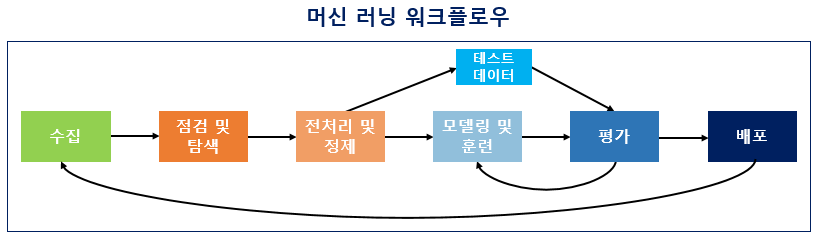
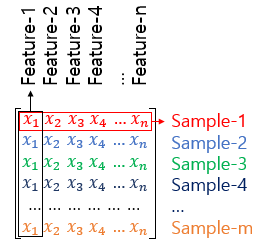
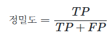
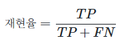
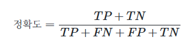

# 머신 러닝 워크플로우(Machine Learning Workflow)

- 이게 머신 러닝의 기본적인 flow이다
-> 굳이 상세히?
## 머신러닝 이전의 상황
- 이전에 어떠한 물체를 예측하는 방식은 사람이 일일이 특징을 정의 방식을 채택했다
- 그러나 살짝의 변형이 있는 경우에 특징이 확 달라지니 인간이 이것을 다 하기에는 불가능에 가깝다
#### 그래서 이제는 기계보고 데이터를 때려줄테니 알아서 해라라는 머신러닝이 나왔다

# 머신러닝 모델 평가 방식
- 먼저 전체 데이터를 3가지로 나눈다
1. 훈련용 데이터
2. 검증용 데이터
3. 테스트용 데이터
## 검증용 데이터
- 이 데이터는 성능을 평가하는게 아니라 성능을 조정하는 데이터
- 데이터에 과접합(overfitting)돼있는지 확인 or 하이퍼파라미터 조정
#### **하이퍼파라미터 vs 매개변수**
- 하이퍼파라미터 == 모델 성능에 영향을 주는 요소중에서 사람이 지정한 변수 

예시 == 딥 러닝에서 뉴런의 수나 층의 수와 같은 것
- 매개변수 == 모델 성능에 영향을 주는 요소중에서 훈련데이터로 인해 자동적으로 지정이 된 요소들

예시 == 가중치,편향 등등
#### 앞에서 말한 하이퍼파라미터를 조정하는 것을 튜닝(tuning)이라고 한다

# 머신 러닝에서 다루는 문제 유형 == 분류(Classification)와 회귀(Regression)
## 분류(Classification)  
  입력 데이터를 미리 정해진 여러 범주(클래스) 중 하나로 분류하는 문제  
  예시: 스팸 메일 분류, 사진 속 동물 종류 분류 등
### 대표
로지스틱 회귀(Logistic Regression)
- 여기서 또 이진 분류(Binary Classification),다중 클래스 분류(Multi-Class Classification)로 나뉨
- 이진 분류 == 둘중 하나의 답만 해야하는 상황
- 다중 클래스 분류 == 여러개의 선택지 중에서 하나를 선택해야하는 문제 
## 회귀(Regression)  
  입력 데이터로부터 연속적인 값을 예측하는 문제  
  예시: 집값 예측, 온도 예측 등
### 대표
선형 회귀(Lineare Regression)

# 지도 학습,비지도 학습,자기지도 학습,강화 학습
## 지도 학습(Supervised Learning)
레이블(Label)이라는 정답과 함께 학습하는 경우
## 비지도 학습(Unsupervised Learning)
레이블(label)이라는 것이 없는 상태에서 학습을 하는 경우
## 자기지도 학습(Self-Supervised Learning, SSL)
레이블(label)이 없이 학습 + 자기가 레이블(label)을 생성
## 강화 학습
강화 학습은 에이전트(Agent)가 환경(Environment)과 상호작용하면서,  
행동(Action)을 취한 결과로 보상(Reward)을 받고,  
이 보상을 최대화하는 방향으로 스스로 학습하는 방법이다.

즉, 정답(레이블)이 주어지는 것이 아니라,  
행동의 결과에 따라 보상을 받으면서 시행착오를 통해 최적의 전략(Policy)을 찾아가는 방식이다.

예시: 게임 플레이, 로봇 제어, 자율주행 등

# 샘플(Sample)과 특성(Feature)
많은  머신 러닝 문제가 1개 이상의 독립 변수 x를 가지고 종속 변수 y를 예측하는 문제이다

이 그림은 독립 변수 x의 행렬을 X라고 하였을 때, 독립 변수의 개수가 n개이고 데이터의 개수가 m인 행렬 X는 다음과 같습니다.
- 샘플(Sample) == 행렬 관점에서는 하나의 행
- 특성(Feature) == 종속 변수 y를 예측하기 위한 각각의 독립 변수x 

# 혼동 행렬(Confusion Matrix)
- 정확도 == 맞은 문제수/전체 문제수
  
but 세부적인 내용은 알 방도가 없다 == 혼동 행렬 
## 혼동 행렬(Confusion Matrix) 용어 정리

- **True Positive (TP)** : 실제 값이 True(참)인 정답을 모델이 True(참)라고 예측 (정답)
- **False Positive (FP)** : 실제 값이 False(거짓)인 정답을 모델이 True(참)라고 예측 (오답, "Type I error", 위양성)
- **False Negative (FN)** : 실제 값이 True(참)인 정답을 모델이 False(거짓)라고 예측 (오답, "Type II error", 위음성)
- **True Negative (TN)** : 실제 값이 False(거짓)인 정답을 모델이 False(거짓)라고 예측 (정답)
## 정밀도(Precision)
정의 ==  모델이 True라고 분류한 것 중에서 실제 True인 것의 비율

## 재현율(Recall)
정의 ==  실제 True인 것 중에서 모델이 True라고 예측한 것의 비율

## 정확도(Accuracy)

이거만 믿으면 큰 문제가 생긴다

# 과적합(Overfitting)과 과소 적합(Underfitting)
- 과적합 == 훈련데이터에 너무 적합해져서 실재로 알려는 것과는 거리가 멀어지는 문제
- 과소적합 == 훈련데이터가 부족 OR 훈련 횟수가 적다

# 출처 == https://wikidocs.net/32012

<!-- 
# 그냥 공부하다가 알게 된 내용
# 텍스트 전처리
- 대부분의 과정은 나와는 상관이 없어서 생략(나는 그냥 머신 러닝만 하면 되니까)
## 패딩(padding) //자연어 처리에서 
정의 == 택스트는 다른 데이터와 다르게 모든 문장이 같은 길이가 아니다 그래서 그것을 맞추기 위하여 임의의 숫자(0)를 대입하는것
- 여기서 내가 하고 싶은 이야기는 이게 아니라
- 단어를 정수로 바꿀떄(정수 인코딩) 거기서 나오는 숫자의 크기는 어떠한 의미를 가지고 있는게 아니라 그냥 나온 순서이다
- 그니까 새로운 숫자가 나올때 마다 단어 사전에는 n+1의 숫자가 부여되는 것이다 -->