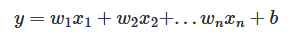
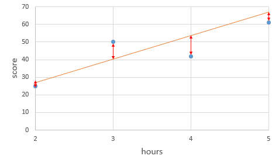
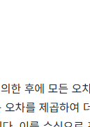
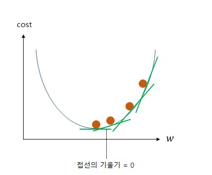

# 선형 회귀(Linear Regression)
 가설(Hypothesis), 손실 함수(Loss Function) 그리고 경사 하강법(Gradient Descent)
## 단순 선형 회귀 분석(Simple Linear Regression Analysis)
```
y = wx +b
```
- w == 가중치(weight)
- b == 편향(bias)
## 다중 선형 회귀 분석(Multiple Linear Regression Analysis)

- 여러가지의 경우의 수를 확인해야 할때 사용한다


# 가설(Hypothesis) == H(x) 
정의 == 데이터 x,y의 관계를 확인하기 위해 수학적으로 식을 세워보는 것(이것을 머신러닝에서)


# 비용 함수(Cost function) : 평균 제곱 오차(MSE)
- 가중치와 편향을 찾기 위하여 실제값과 가설로부터 얻은 예측값의 오차를 계산하는 식을 세우고 이 값이 가장 작아지게 가중치와 편향을 찾는다
- 목적 함수(Objective function) = 비용 함수(Cost function) == 손실 함수(Loss function)
## 오차(error)

- 여기 이미지에서 직선(가설)과 점(데이터) 사이의 거리가 오차이다

- 이렇게 오차가 양수나 음수로 나오기에 제곱하고 더한다 == 평균 제곱 오차(Mean Squered Error, MSE)


# 옵티마이저(Optimizer) : 경사하강법(Gradient Descent) == 최적화 알고리즘
- 가중치(기울기)만 가지고 숫자를 바꾸면서 최적을 찾아가는 방식


# 출처  == https://wikidocs.net/21670


# 로지스틱 회귀(Logistic Regression)
이거는 연속이 아니라 2진이라서 그래프가 s자로 급격하게 바뀐다


