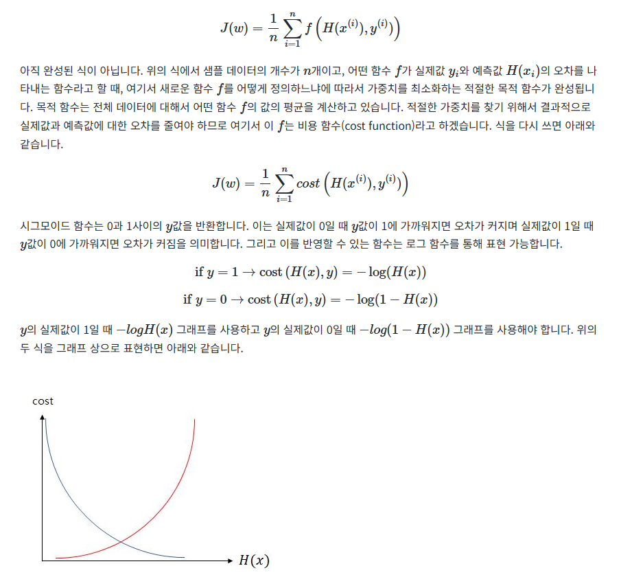

# 로지스틱 회귀(Logistic Regression)
2가지 선택지를 선택해야 하는 상황이 있는데{이진 분류(Binary Classification)} 이거를 로지스틱회구로 해결을 한다
## 이진 분류(Binary Classification)
- 앞에서 선형 회귀는 직선으로 최적의 함수를 찾으러 갔다 하지만 2가지 참,거짓으로 되어 있는 문제에서는 이런게 유용하지 않을 가능성이 있다

- 그래서 이렇게 직선이 아닌 S자 형식의 함수가 나오게 된다
## 시그모이드 함수(Sigmoid function)
### 수식

### 함수 설명
- 가중치는 1인 함수

- w == 1 , b = 0

- 빨강(w == 0.5)

- b를 움직이는 방식
## 비용 함수(Cost function)
- 여기서 경사하강법을 사용하면 로컬 미니멈을 찾는 오류가 생길 가능성이 있다

#### 그래서 사용하는 방식

# 출처 == https://wikidocs.net/22881

